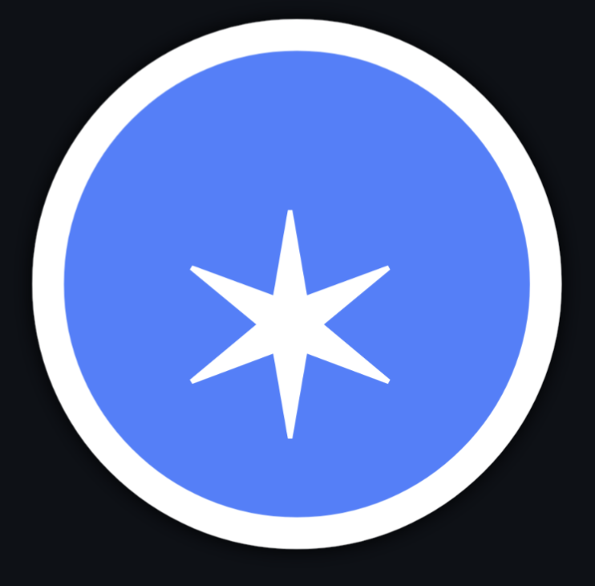

# pondiverse

[pondiverse](https://pondiverse.com) is a place to create and explore things in a network of connected tools.

anyone can join in!

learn more on the [learn](https://pondiverse.com/learn) page

## code

client side code is here on github.

server side code is on [val town](https://www.val.town/x/todepond/pondiverse)

## jam

this is a jam. anyone can get involved. all contributions get accepted no matter what. let someone know if you want admin access. it's okay if stuff breaks
